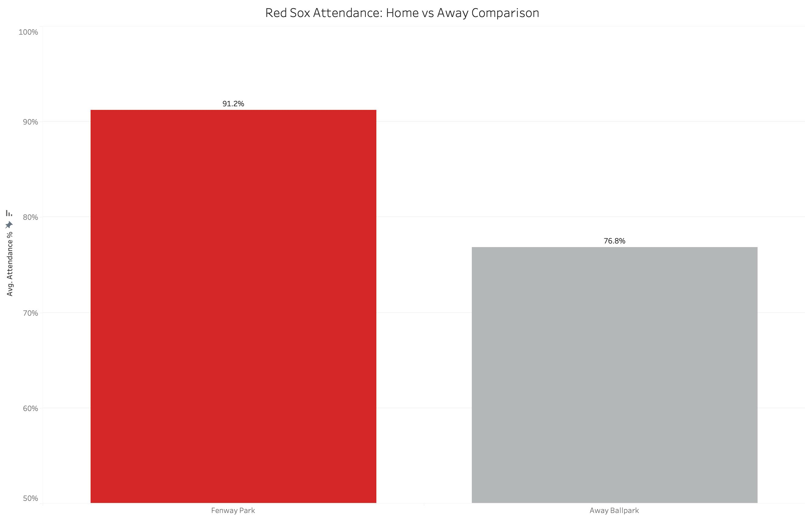
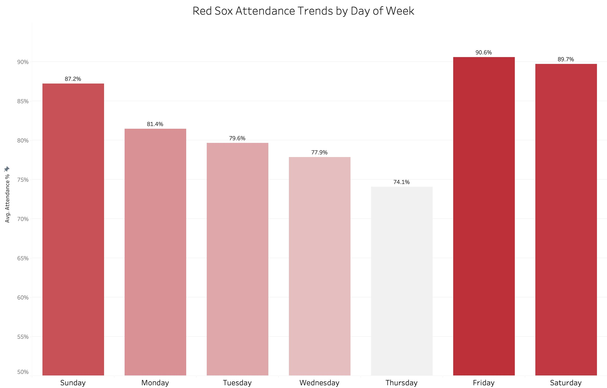
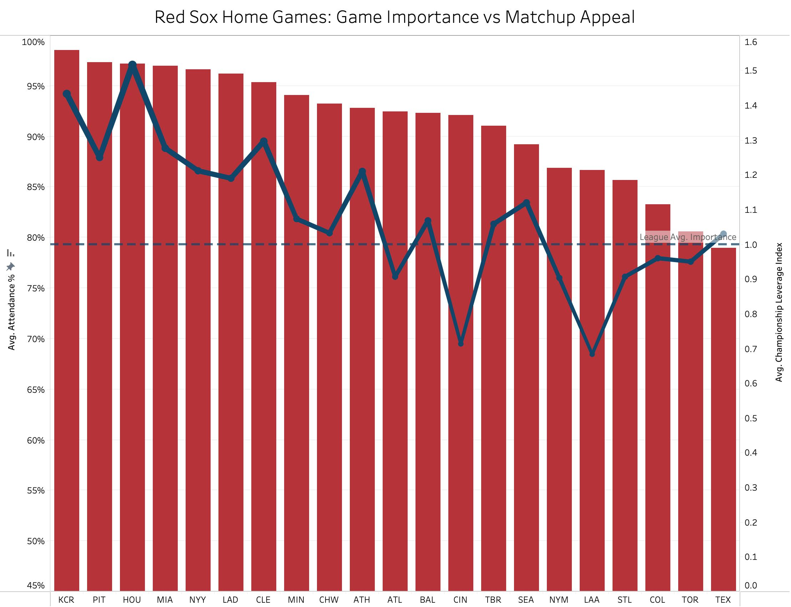
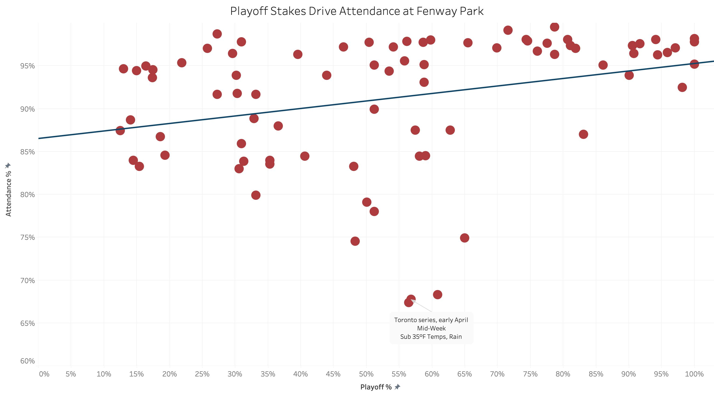

# What Actually Fills Fenway: A Data Look at the 2025 Red Sox

**By Elijah Wekstein**  
CU Boulder — Business Analytics & Information Management

---

## Overview

The Boston Red Sox are one of the oldest and most recognizable organizations in baseball, but that doesn't insulate them from fluctuating fan turnout. Throughout a long 162-game season, attendance rises and falls based on performance, opponent, scheduling, and timing.

This project explores what actually drove fans to Red Sox games in 2025 — analyzing attendance trends across different environments and examining how factors like day of the week, matchup quality, and playoff relevance are associated with turnout.

**Data sources:** [Baseball-Reference](https://www.baseball-reference.com) and [FanGraphs](https://www.fangraphs.com)

> **Note on methodology:** Because every MLB ballpark has a different maximum capacity, all attendance figures in this analysis are expressed as a percentage of stadium capacity rather than raw numbers. A crowd of 32,000 means something very different at Fenway Park (37,755 capacity) than at Dodger Stadium (56,000 capacity). Percentage-based attendance creates a more honest comparison across home and road environments.

---

## Tools

- Microsoft Excel — data collection and preparation
- Tableau — visualization and analysis

---

## Objectives

- Analyze attendance trends across the 2025 Red Sox season
- Compare home and away attendance patterns
- Identify which matchups and scheduling factors are associated with stronger turnout
- Explore whether momentum and playoff relevance influence attendance

---

## Analysis

### Home vs. Away: Fenway's Pull

Before digging into the variables that move attendance up or down, it helps to establish the baseline. How does Fenway compare to everywhere else the Red Sox played in 2025?

The gap is significant — and it's not just about the home-crowd advantage every team enjoys. Fenway Park carries its own gravitational pull. The park itself is a destination, and that shows up in the data. Road venues, even full ones, simply don't draw Red Sox fans the way home games do. With that baseline set, the more interesting question becomes: what moves the needle within the home schedule?

---

### Day of Week: Fridays and Saturdays Dominate

Scheduling has a measurable effect on attendance. A typical baseball week has series running Monday–Thursday, then a second on Friday–Sunday. These scheduling patterns create a clear attendance pattern.

Friday and Saturday nights are the clear winners — weekend evening games are the easiest sell in any sport. Sunday afternoons hold up well too, carrying the tail end of a weekend series when fans are still in the mood.

The mid-week numbers tell a different story. Monday and Tuesday show a noticeable dip, Wednesday drops further, and Thursday stands out as the softest day on the schedule by a meaningful margin. Thursday games are almost always the final game of a series, often played in the afternoon as a getaway day. That combination of awkward timing, afternoon starts, and the middle of a workweek creates a consistent attendance drag that no opponent or playoff race can fully overcome.

---

### Matchup Appeal: Who Puts Fans in the Seats?

Some opponents just draw differently. Part of it is star power; fans want to see the best players regardless of what the standings say. Part of it is rivalry — certain matchups carry emotional weight that no amount of mediocre team performance can suppress.

This chart layers in Championship Leverage Index (cLI), a metric that measures how much each individual game matters to a team's World Series odds. A score above 1.0 indicates above-average importance; below 1.0 means the game carries relatively low stakes.

At first glance, the chart tells a clean story: higher cLI games tend to draw better crowds. But dig deeper and a more interesting pattern emerges — attendance and cLI rise together in the back half of the season, which makes sense. Late-season games are inherently more important AND better attended because the playoff race is alive. The two metrics are less cause-and-effect and more two symptoms of the same thing: a team that gave its fans something to believe in as the season went on.

---

### Playoff Stakes: The Strongest Driver of All

To measure how playoff stakes influence attendance game by game, every home game of the 2025 season is plotted with playoff probability on the x-axis and attendance percentage on the y-axis.

The trend line shows a clear upward relationship — as playoff odds climbed, so did attendance. But what's more telling than the trend line is the shape of the data around it.

In the early months, when playoff odds were still low, the dots scatter widely above and below the line. Some games drew well, others didn't, and when they didn't, the reasons were usually external: cold April nights, mid-week afternoon scheduling, rain. The annotation on those low outliers tells the story — early April, mid-week, sub-35°F temperatures and rain. Fenway is an open-air ballpark, and New England in early spring is unforgiving.

But look at what happens on the right side of the chart. As playoff probability climbs above 70%, the scatter almost disappears. The dots cluster tightly at the top, game after game drawing 95%+ capacity, with almost no soft nights mixed in. When the Red Sox were genuinely in the race, bad weather and inconvenient scheduling stopped mattering. Fans showed up regardless.

---

## Key Findings

- **Fenway's baseline is elite.** Home games averaged 91.2% capacity vs. 76.8% on the road. The park's history and reputation create an attendance floor most MLB teams can't match.
- **Weekend games dominate.** Fridays (90.6%) and Saturdays (89.7%) consistently outperformed mid-week dates. Thursdays (74.1%) were the softest day on the schedule.
- **Playoff probability was the strongest driver.** The gap between contender-level crowds and long-shot-level crowds was nearly nine percentage points — a meaningful difference for a park of Fenway's size.
- **Context always matters.** The worst-attended home games of the year were a product of overlapping factors: early-season cold weather, rain, and mid-week afternoon scheduling.

---

## Conclusion

The 2025 Red Sox attendance story comes down to two things: stakes and context. When the playoff race was real, Fenway was packed. When the season felt directionless, the crowds reflected that.

What stands out most is how the scatter tightens as the season goes on. Early in the year, there were soft nights mixed in with the good ones. By August and September, those soft nights were almost gone entirely. That shift is the clearest signal in the whole dataset: when something is genuinely worth showing up for, Boston fans show up.

---

## Repository Contents

| File | Description |
|------|-------------|
| `RedSox_2025_Data.xlsx` | Raw game-by-game attendance and performance data |
| `RedSox2025.twbx` | Tableau packaged workbook with all visualizations |
| `README.md` | Project writeup and analysis |

---

## About

This was my first sports analytics project, built in Excel and Tableau as I work toward a career in the field.

**Elijah Wekstein** — [LinkedIn](https://www.linkedin.com/in/elijah-wekstein) | [Portfolio](https://ewekstein.github.io)
